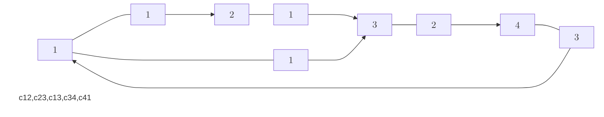

## [`Ciclu`](https://www.infoarena.ro/problema/ciclu)

Se dă un graf orientat ponderat $G = (V, E)$ cu $n$ noduri și $m$ arce, cu funcția de cost $w : E \to \mathbb{R}$, pentru care avem 

$$ w(e) > 0, \forall e \in E. $$

Pentru un ciclu $c = (v_0, v_1, \ldots, v_k)$, $v_0 = v_k$, definim costul acestuia prin

$$ w(c) = \sum_{i = 1}^{k} w(v_{i - 1}, v_i), $$

precum și costul său mediu ca fiind egal cu $\mu(c) = \frac{w(c)}{k}$.

Se cere să se determine costul mediu minim al vreunui ciclu, adică valoarea:

$$ \min_{c = (v_0, v_1, \ldots, v_k)} \mu(c) = \min_{c = (v_0, v_1, \ldots, v_k)} \frac{w(c)}{k} . $$

*Soluție.* Să considerăm exemplul din enunțul problemei.

| ciclu.in    | ciclu.out  |
|-------------|------------|
| $4$ $5$     | $1.75$     |
| $1$ $2$ $1$ |            | 
| $2$ $3$ $1$ |            |
| $1$ $3$ $1$ |            |
| $3$ $4$ $2$ |            |
| $4$ $1$ $3$ |            |

Obținem graful din figura de mai jos:


Observăm că ciclul $c = (1, 2, 3, 4, 1)$ are $\mu(c) = \frac{7}{4} = 1.75$, iar ciclul $c' = (1, 3, 4)$ are $\mu(c') = \frac{6}{3} = 2$. Deoarece graful are numai două cicluri ($c$ și $c'$), răspunsul este $1.75$.

Să revenim acum la cazul general. Dorim să determinăm un ciclu de cost mediu minim, adică să aflăm o valoare $\mu$ minimă pentru care există un ciclu $c$ cu $0 < \mu(c) \leqslant \mu$. Cum $\mu$ este minimă cu această proprietate, pentru orice $\lambda < \mu$, avem $\mu(c) > \lambda$, pentru orice ciclu $c$, deci $\mu \geqslant \min\limits_{c = (v_0, v_1, \ldots, v_k)} \mu(c) > \lambda$ pentru $\lambda < \mu$. Trecând la limită după $\lambda$,

$$ \mu \geqslant \min_{c = (v_0, v_1, \ldots, v_k)} \mu(c) \geqslant \lim_{\lambda \nearrow \mu} \lambda = \mu, $$

adică $\min\limits_{c = (v_0, v_1, \ldots, v_k)} \mu(c) = \mu$.

Fie $x$ un număr real arbitrar. Considerând funcția de cost $w' : E \to \mathbb{R}$, $w' = w - x$, adică 

$$ w'(e) = w(e) - x, \forall e \in E, $$

și adaptând notația pentru costul unui ciclu, găsim că

$$ w'(c) = \sum_{i = 1}^{k} w'(v_{i - 1}, v_i) = \sum_{i = 1}^{k} w(v_{i - 1}, v_i) - kx = w(c) - kx, $$

pentru orice ciclu $c = (v_0, v_1, \ldots, v_k)$, $v_0 = v_k$.

Împărțind cu $k$ (numărul de muchii dintr-un ciclu $c$), deducem că

$$ \mu'(c) = \mu(c) - x \iff \mu(c) = \mu'(c) + x. $$

Dacă în graful $G$ cu funcția de cost $w'$ ar exista un ciclu $c$ cu cost negativ, $w'(c) = k\mu'(c) < 0 \iff \mu'(c) < 0$, am avea $\mu(c) < x$, i.e. există un ciclu $c$ de cost mai mic ca $x$.

Pentru a testa dacă în graful orientat $G$ cu funcția de cost $w'$ are cicluri de cost negativ, folosim algoritmul Bellman-Ford de complexitate $O(NM)$. Totodată, pentru a determina valoarea $\mu$ minimă, aminitită la începutul soluției, vom folosi un algoritm de căutare binară.

Complexitate temporală: $O(NM \log C)$, unde $C$ este costul maxim al unui ciclu din graf.

*Codul sursă.*
```cpp
#include <fstream>
#include <iomanip>

using namespace std;

ifstream fin("ciclu.in");
ofstream fout("ciclu.out");

const int MAX_N = 1000;
const int MAX_M = 4000;
const int INF = 1 << 30;
const double EPS = 0.001;

struct Edge
{
    int u, v, cost;
};

Edge edges[MAX_M + 1];
double dist[MAX_N + 1];
int n, m;

void ReadGraph()
{
    fin >> n >> m;
    for(int i = 1; i <= m; i++)
        fin >> edges[i].u >> edges[i].v >> edges[i].cost;
}

void Init(int src)
{
    for(int i = 1; i <= n; i++)
        dist[i] = INF;
    dist[src] = 0;
}

void RelaxEdge(Edge edge, double x)
{
    if(dist[edge.v] > dist[edge.u] + edge.cost + x)
        dist[edge.v] = dist[edge.u] + edge.cost + x;
}

bool NegativeCycle(int src, double x)
{
    Init(src);
    for(int step = 1; step < n; step++)
        for(int i = 1; i <= m; i++)
            RelaxEdge(edges[i], x);
    for(int i = 1; i <= m; i++)
        if(dist[edges[i].v] > dist[edges[i].u] + edges[i].cost + x)
            return true;
    return false;
}

void BinarySearch()
{
    double left = 0, right = INF, res = INF;
    while(right - left > EPS)
    {
        double mid = left + (right - left) / 2;
        if(NegativeCycle(1, -mid))
        {
            res = mid;
            right = mid - EPS;
        }
        else
            left = mid + EPS;
    }
    fout << fixed << setprecision(2) << res << '\n';
}

int main()
{
    ReadGraph();
    BinarySearch();

    fin.close();
    fout.close();

    return 0;
}
```